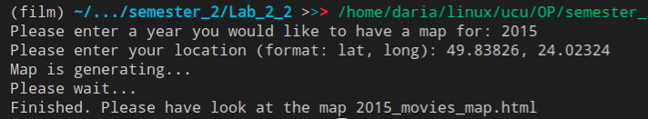
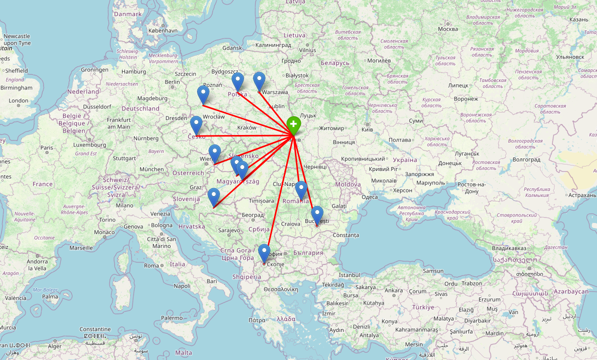

# Map generator

1. **Інформація про призначення модуля**
Даний модуль призначений для генерації мапи з 10 точками, де знімали фільми в певний рік недалекого від певної локації.
Усі мітки з місць знімання фільмів знаходяться не далі, ніж 1000 км від заданої локації.

1. **Висновок про інформацію, яку надає карта**
Дана карта дозволяє візуалізувати 10 місць, що знаходяться недалеко від вказаної локації, а також з'єднує її червоною лінією з кожною з 10 точок.

1. **Приклад запуску**
Введені дані:

Приклад створеної мапи:

1. **Опис html файлу**
Згенерований файл складається з блоку < head>...</ head>, який мість стилі, посилання на js-код, та на css-файли зі стилями та іншу інформацію.
Блок < body>...</ body>, мість лише тег < div>...</ div>, який відповідає за власне карту.
Блок < script>...</ script> мість js-код, який відповідає за створення мапи, шарів, маркерів та ліній.